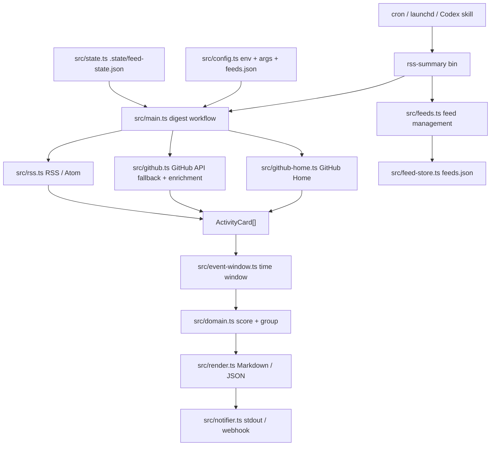

# Architecture

`rss-summary` is a local TypeScript CLI plus a small set of portable Codex skills. It is not a daemon or hosted service. Scheduling is handled outside the repo by cron, launchd, systemd, or Codex automation.

The runtime goal is simple: collect rendered GitHub Home activity and RSS/Atom items, normalize them into one activity model, rank the useful projects/articles, and emit a digest that can be read directly or sent to a webhook.

## High-Level Flow



## Runtime Boundaries

- CLI layer: `src/cli.ts` is the package `bin` entrypoint. It routes `rss-summary digest` to the digest workflow and `rss-summary feeds ...` to feed management.
- Application workflow: `src/main.ts` owns IO orchestration. It loads config, fetches sources, enriches GitHub repos/PRs, applies state, renders output, and sends notifications.
- Source adapters: `src/github-home.ts`, `src/github.ts`, and `src/rss.ts` fetch external data and convert source-specific payloads into the shared domain shape. `src/github-home.ts` is the exact GitHub Home source; `src/github.ts` is API fallback plus enrichment.
- Domain layer: `src/domain.ts` owns normalization of GitHub events, high-signal filtering, scoring, category selection, and candidate grouping. It should not perform network or filesystem IO.
- Local persistence: `src/feed-store.ts` manages RSS subscriptions. `src/state.ts` manages local digest state.
- Presentation and delivery: `src/render.ts` formats Markdown/JSON. `src/notifier.ts` prints to stdout and optionally posts a generic webhook payload.
- Skills: `skills/*` describe how Codex should configure, run, research, or manage feeds using this repo.

## Domain Model

`ActivityCard` is the normalized input unit. GitHub events and RSS items both become activity cards with a source, actor, repository-like identifier, timestamp, title, summary, and link fields.

`CandidateProject` is the ranked output unit. It groups related cards by repository or article identity, records actors and event types, assigns a category, and explains why the item is worth attention.

Current candidate categories:

- `discovery`: stars, forks, newly created repositories, trending repositories, recommendations, and follows.
- `activity`: pull request activity and other project movement.
- `release`: release events.
- `article`: RSS/Atom items.

Current high-signal event types:

- GitHub Home rendered cards as `pull_request`, `fork`, `create`, `watch`, `trending`, `recommendation`, `follow`, `announcement`, or `release`.
- GitHub `WatchEvent` as `watch`.
- GitHub `PullRequestEvent` as `pull_request`.
- GitHub `ReleaseEvent` as `release`.
- GitHub `ForkEvent` as `fork`.
- GitHub repository `CreateEvent` as `create`.
- RSS/Atom entries as `article`.

## Digest Workflow

`rss-summary digest` currently runs this sequence:

1. `src/config.ts` reads environment variables, CLI flags, optional `feeds.json`, and default interests.
2. `src/main.ts` fetches GitHub Home cards and RSS/Atom feeds in parallel. If `GITHUB_FEED_SOURCE=events`, it fetches REST `received_events` instead.
3. `src/event-window.ts` filters events by either an explicit calendar day or a rolling hour window.
4. `src/github.ts` optionally fetches followed accounts, repository metadata, and up to 20 pull request details.
5. `src/domain.ts` builds ranked `CandidateProject` records from normalized events.
6. `src/state.ts` filters previously seen event IDs when `--only-new` is set.
7. `src/render.ts` emits Markdown or JSON.
8. `src/notifier.ts` writes to stdout and optionally sends `{ "text": markdown }` to `NOTIFY_WEBHOOK_URL`.
9. If `--only-new` is set and the run is not `--dry-run`, `.state/feed-state.json` is updated with seen event IDs.

For scheduled daily summaries, prefer explicit calendar-day mode:

```bash
FEED_DAY="$(TZ=Asia/Shanghai date +%F)" rss-summary digest --only-new
```

Without `FEED_DAY` or `--day`, the CLI uses the compatibility rolling window from `FEED_WINDOW_HOURS`, defaulting to 36 hours.

## Feed Management Workflow

RSS/Atom sources are maintained in the tracked `feeds.json` file. The CLI manages that shared subscription list through `src/feeds.ts`:

```bash
rss-summary feeds add --url "https://example.com/feed.xml" --name "Example" --tags "ai,agent"
rss-summary feeds list
rss-summary feeds test
rss-summary feeds remove --url "https://example.com/feed.xml"
```

Commit intentional `feeds.json` changes through the pull request workflow. For one-off runs, `RSS_FEEDS='[...]'` can provide the same JSON array without modifying the tracked subscription list.

## Research Workflow

Deep research is currently a Codex skill workflow, not a deterministic CLI subcommand.

The CLI can emit machine-readable candidates:

```bash
rss-summary digest --json --only-new --dry-run
```

`skills/feed-research-digest` consumes those candidates and instructs Codex to inspect the relevant repository, PR, release, README, docs, or article page before deciding whether an item is worth attention.

The state file already has a `researched` field, but the CLI does not yet write or filter by it. Today, `--only-new` tracks seen event IDs. A future research-cache feature should wire `state.researched` into the research workflow so previously researched repositories/articles are skipped or summarized differently.

## GitHub Identity And Visibility

The machine identity does not control GitHub visibility. In exact Home mode, the saved GitHub web session identity does. In REST fallback mode, the token identity does.

- `GITHUB_FEED_SOURCE=home` opens github.com with `.state/github-home-storage.json` and reads the same rendered Home feed cards the account sees in the browser.
- `rss-summary github-home login` creates or refreshes that storage state. Do this once on each scheduled machine.
- `GITHUB_FEED_SOURCE=events` uses `received_events`; a token created by `PerfectPan` can see `PerfectPan` received events that the token is allowed to read, while another account only sees public received events for `PerfectPan`.

Keep `GH_FEED_TOKEN`, `.env`, and `.state/` out of git. `feeds.json` is intentionally tracked as the shared RSS subscription list.

## Extension Points

- Add a new source: create an adapter that returns `ActivityCard[]`, then wire it into `src/main.ts` before the event-window filter.
- Add RSS-like source management: extend `src/feed-store.ts` and `src/feeds.ts` if the source needs local subscriptions.
- Tune usefulness: adjust interests, base scores, category rules, or reason generation in `src/domain.ts`.
- Add deep research caching: connect `state.researched` to the research skill or add a dedicated CLI command that records research decisions.
- Add delivery channels: extend `src/notifier.ts` or add notifier adapters for Feishu, Slack, Telegram, email, or other targets.
- Add content deduplication: cluster RSS/article candidates by canonical URL, title, or content fingerprint before scoring.

## Current Gaps

- GitHub Home exact mode depends on GitHub's rendered DOM and `data-hydro-view` card metadata, so it may need maintenance if github.com changes the Home page structure.
- Deep project/article research is skill-driven, not a built-in CLI command.
- `researched` state exists in the schema but is not yet used by the CLI.
- Webhook delivery is generic only.
- RSS deduplication is based on generated item IDs, not content similarity.
- Scheduling is external; there is no built-in daemon.
