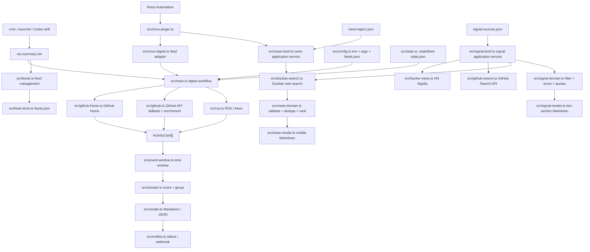

# Architecture

`rss-summary` is a local TypeScript CLI, a small set of portable Codex skills, and an external Rivus Plugin. It is not a daemon or hosted service. Scheduling is handled outside the repo by cron, launchd, systemd, Codex automation, or a Rivus deployment daemon.

The runtime goal is simple: produce a previous-day technical subscription digest from GitHub Home and RSS, plus bounded noon/evening headline briefs from authoritative web search, plus a once-per-day high-signal brief (高信号速览) from public GitHub Search, Hacker News, and official-domain search. Collection and ranking stay independent from Rivus scheduling and Feishu delivery.

## High-Level Flow


```mermaid
flowchart TD
  Trigger["cron / launchd / Codex skill"] --> CLI["rss-summary bin"]
  RivusSchedule["Rivus Automation"] --> Plugin["src/rivus-plugin.ts"]
  Plugin --> FeedAdapter["src/rivus-digest.ts feed adapter"]
  Plugin --> NewsBrief["src/news-brief.ts news application service"]
  FeedAdapter --> Digest
  CLI --> Digest["src/main.ts digest workflow"]
  CLI --> FeedsCommand["src/feeds.ts feed management"]

  Config["src/config.ts env + args + feeds.json"] --> Digest
  Digest --> GitHubHome["src/github-home.ts GitHub Home"]
  Digest --> GitHub["src/github.ts GitHub API fallback + enrichment"]
  Digest --> RSS["src/rss.ts RSS / Atom"]

  GitHubHome --> Cards["ActivityCard[]"]
  GitHub --> Cards
  RSS --> Cards
  Cards --> Window["src/event-window.ts time window"]
  Window --> Domain["src/domain.ts score + group"]

  State["src/state.ts .state/feed-state.json"] --> Digest
  Domain --> Render["src/render.ts Markdown / JSON"]
  Render --> Notify["src/notifier.ts stdout / webhook"]

  Topics["news-topics.json"] --> NewsBrief
  NewsBrief --> Doubao["src/doubao-search.ts Doubao web search"]
  Doubao --> NewsDomain["src/news-domain.ts validate + dedupe + rank"]
  NewsDomain --> NewsRender["src/news-render.ts mobile Markdown"]

  SignalSources["signal-sources.json"] --> SignalBrief["src/signal-brief.ts signal application service"]
  SignalBrief --> HackerNews["src/hacker-news.ts HN Algolia"]
  SignalBrief --> GithubSearch["src/github-search.ts GitHub Search API"]
  SignalBrief --> Doubao
  SignalBrief --> SignalDomain["src/signal-domain.ts filter + score + quotas"]
  SignalDomain --> SignalRender["src/signal-render.ts two-section Markdown"]

  FeedsCommand --> FeedStore["src/feed-store.ts feeds.json"]
```

## Runtime Boundaries

- CLI layer: `src/cli.ts` is the package `bin` entrypoint. It routes `rss-summary digest` to the digest workflow and `rss-summary feeds ...` to feed management.
- Application workflow: `src/main.ts` owns IO orchestration. It loads config, fetches sources, enriches GitHub repos/PRs, applies state, renders output, and sends notifications.
- Source adapters: `src/github-home.ts`, `src/github.ts`, and `src/rss.ts` feed the technical digest. `src/doubao-search.ts` is the bounded web-news adapter; it requests an exact calendar day, query rewrite, URLs, and the required source-authority level.
- Domain layer: `src/domain.ts` owns normalization of GitHub events, high-signal filtering, scoring, category selection, and candidate grouping. It should not perform network or filesystem IO.
- Local persistence: `src/feed-store.ts` manages RSS subscriptions. `src/state.ts` manages local digest state.
- Presentation and delivery: `src/render.ts` formats Markdown/JSON. `src/notifier.ts` prints to stdout and optionally posts a generic webhook payload.
- News application/domain: `src/news-brief.ts` defines noon/evening windows and orchestrates queries. `src/news-domain.ts` independently rechecks publication time and source authority, canonicalizes URLs, merges duplicate hits, ranks stories, and applies quotas. `src/news-render.ts` owns the mobile Markdown layout.
- Signal application/domain: `src/signal-brief.ts` defines the once-per-day calendar window and fans out to the three public sources. `src/signal-sources.ts` loads and validates `signal-sources.json` (quotas, frontend bias, scoring weights, source settings); the file is intentionally not an RSS subscription list. `src/signal-domain.ts` filters and scores updates and repos, canonicalizes URLs, collapses duplicate events, and applies per-section plus global quotas. `src/signal-render.ts` emits the two-section Markdown (动态 + 开源) and omits empty sections. The signal pipeline never reads `feeds.json` or calls `RssClient`.
- Rivus boundary: `src/rivus-plugin.ts` registers one profile, three observe-only Tools, and the morning/noon/evening/signal templates. `src/rivus-digest.ts`, `src/news-brief.ts`, and `src/signal-brief.ts` validate Tool input and call their application workflows; neither owns scheduling or Feishu delivery.
- Skills: `skills/*` describe how Codex should configure, run, research, or manage feeds using this repo.

## Domain Model

`ActivityCard` is the normalized input unit. GitHub events and RSS items both become activity cards with a source, actor, repository-like identifier, timestamp, title, summary, and link fields.

`CandidateProject` is the ranked output unit. It groups related cards by repository or article identity, records actors and event types, assigns a category, and explains why the item is worth attention.

Current candidate categories:

- `discovery`: stars, forks, newly created repositories, trending repositories, recommendations, and follows.
- `activity`: pull request activity and other project movement.
- `release`: release events.
- `article`: RSS/Atom items.

Current high-signal event types:

- GitHub Home rendered cards as `pull_request`, `fork`, `create`, `watch`, `trending`, `recommendation`, `follow`, `announcement`, or `release`.
- GitHub `WatchEvent` as `watch`.
- GitHub `PullRequestEvent` as `pull_request`.
- GitHub `ReleaseEvent` as `release`.
- GitHub `ForkEvent` as `fork`.
- GitHub repository `CreateEvent` as `create`.
- RSS/Atom entries as `article`.

## Digest Workflow

`rss-summary digest` currently runs this sequence:

1. `src/config.ts` reads environment variables, CLI flags, optional `feeds.json`, and default interests.
2. `src/main.ts` fetches GitHub Home cards and RSS/Atom feeds in parallel. If `GITHUB_HOME_FETCH=conduit`, it directly fetches `/conduit/for_you_feed?requested_from_filter_event=true` with the saved web session and falls back to rendered browser parsing. If `GITHUB_FEED_SOURCE=events`, it fetches REST `received_events` instead. If `--rss-only` or `FEED_RSS_ONLY=true` is set, GitHub fetching is skipped.
3. `src/event-window.ts` filters events by either an explicit calendar day or a rolling hour window.
4. `src/github.ts` optionally fetches followed accounts, repository metadata, and up to 20 pull request details.
5. `src/domain.ts` builds ranked `CandidateProject` records from normalized events.
6. `src/state.ts` filters previously seen event IDs when `--only-new` is set.
7. `src/render.ts` emits Markdown or JSON.
8. `src/notifier.ts` writes to stdout and optionally sends `{ "text": markdown }` to `NOTIFY_WEBHOOK_URL`.
9. If `--only-new` is set and the run is not `--dry-run`, `.state/feed-state.json` is updated with seen event IDs.

`buildDigestDocument` exposes steps 1–6 as a delivery-free application boundary. The CLI renders and delivers the returned document, while the Rivus adapter renders it as Markdown and forces dry-run mode. Rivus `0.3.x` promotes the first Markdown heading into a proactive Feishu card header and owns the card delivery. Both entrypoints therefore share one collection and ranking implementation without importing Feishu concerns into this repository.

For scheduled daily summaries, prefer explicit calendar-day mode:

```bash
FEED_DAY="$(TZ=Asia/Shanghai date +%F)" rss-summary digest --only-new
```

Without `FEED_DAY` or `--day`, the CLI uses the compatibility rolling window from `FEED_WINDOW_HOURS`, defaulting to 36 hours.

## Signal Brief Workflow

`rss-summary signal` (or the Rivus Tool `rss-summary/generate-signal-brief`) answers “what shipped or rose in public AI×dev today”:

1. `src/signal-sources.ts` loads `signal-sources.json`; env overrides: `SIGNAL_SOURCES_FILE`, `SIGNAL_SEARCH_TIMEOUT_MS`.
2. `src/signal-brief.ts` resolves the local calendar day (from `occurrence` or explicit `day`) and fans out in parallel:
   - Doubao official search (`sourcePolicy: "official"`, one query per configured intent, kind `model` or `product`),
   - Hacker News Algolia (`search_by_date`, `points>minPoints`, optional `show_hn` tag), filtered to the day and re-ranked by points,
   - GitHub Repository Search (`created:>=`, `stars:>`, free-text keyword `OR`), sorted by stars.
3. `src/signal-domain.ts` rechecks publication windows, canonicalizes URLs, collapses the same event across publishers, scores deterministically (official-domain, HN points, frontend keywords, recency, cross-source agreement for updates; stars, newness, language/topic match, description/language penalties for repos), and applies quotas (`maxTotal` 8, `updates` 5 with soft model/product balance, `opensource` 4).
4. `src/signal-render.ts` emits `# 高信号速览 · YYYY-MM-DD` with two optional sections and omits empty ones.

There is no persistent `.state` for signal briefs; dedupe is in-run only. The CLI is inherently dry-run (read-only, no webhook).

## Feed Management Workflow

RSS/Atom sources are maintained in the tracked `feeds.json` file. The CLI manages that shared subscription list through `src/feeds.ts`:

```bash
rss-summary feeds add --url "https://example.com/feed.xml" --name "Example" --tags "ai,agent"
rss-summary feeds list
rss-summary feeds test
rss-summary feeds remove --url "https://example.com/feed.xml"
```

Commit intentional `feeds.json` changes through the pull request workflow. The digest command always uses the tracked `feeds.json` as its RSS source list.

## Research Workflow

Deep research is currently a Codex skill workflow, not a deterministic CLI subcommand.

The CLI can emit machine-readable candidates:

```bash
rss-summary digest --json --only-new --dry-run
```

`skills/feed-research-digest` consumes those candidates and instructs Codex to inspect the relevant repository, PR, release, README, docs, or article page before deciding whether an item is worth attention.

The state file already has a `researched` field, but the CLI does not yet write or filter by it. Today, `--only-new` tracks seen event IDs. A future research-cache feature should wire `state.researched` into the research workflow so previously researched repositories/articles are skipped or summarized differently.

## GitHub Identity And Visibility

The machine identity does not control GitHub visibility. In exact Home mode, the saved GitHub web session identity does. In REST fallback mode, the token identity does.

- `GITHUB_FEED_SOURCE=home` uses `.state/github-home-storage.json` and reads the same Home feed cards the account sees in the browser.
- `GITHUB_HOME_FETCH=conduit` is the default Home fetch mode. It parses GitHub's internal conduit HTML response and automatically falls back to browser-rendered parsing when the internal request is unavailable.
- `rss-summary github-home login` creates or refreshes that storage state. Do this once on each scheduled machine.
- `GITHUB_FEED_SOURCE=events` uses `received_events`; a token created by `PerfectPan` can see `PerfectPan` received events that the token is allowed to read, while another account only sees public received events for `PerfectPan`.

Keep `GH_FEED_TOKEN`, `.env`, and `.state/` out of git. `feeds.json` is intentionally tracked as the shared RSS subscription list.

## Extension Points

- Add a new source: create an adapter that returns `ActivityCard[]`, then wire it into `src/main.ts` before the event-window filter.
- Add RSS-like source management: extend `src/feed-store.ts` and `src/feeds.ts` if the source needs local subscriptions.
- Tune usefulness: adjust interests, base scores, category rules, or reason generation in `src/domain.ts`.
- Add deep research caching: connect `state.researched` to the research skill or add a dedicated CLI command that records research decisions.
- Add delivery channels: extend `src/notifier.ts` or add notifier adapters for Feishu, Slack, Telegram, email, or other targets.
- Add Rivus capabilities: register narrow Tools in `src/rivus-plugin.ts` and delegate them to application-level functions instead of copying source or ranking logic into the Plugin.
- Add content deduplication: cluster RSS/article candidates by canonical URL, title, or content fingerprint before scoring.
- Add signal sources (later tiers): Hugging Face, Product Hunt, or GitHub Trending HTML adapters feed `SignalRepoHit`-shaped candidates into `src/signal-domain.ts`.
- Add persistent signal state: introduce a `.state/signal-state.json` seen-set so repos/URLs are not re-pushed within N days; keep it behind an explicit flag.

## Current Gaps

- GitHub Home exact mode depends on GitHub's internal conduit endpoint, rendered DOM, and `data-hydro-view` card metadata, so it may need maintenance if github.com changes the Home page structure.
- Deep project/article research is skill-driven, not a built-in CLI command.
- `researched` state exists in the schema but is not yet used by the CLI.
- Webhook delivery is generic only.
- RSS deduplication is based on generated item IDs, not content similarity.
- This repository has no built-in daemon; a consuming Rivus deployment can host the exported Automation.
