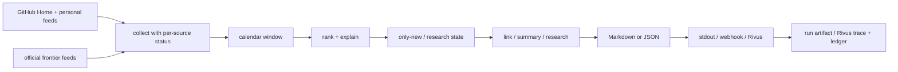

# Architecture

`rss-summary` is a local TypeScript CLI, a set of portable skills, and an external Rivus Plugin. Scheduling belongs to cron, launchd, systemd, Codex automation, or Rivus; the repository is not a hosted service.

## Product boundaries

The source type does not decide the product. The user's relationship to the source does:

| Product | Question | Sources | State |
| --- | --- | --- | --- |
| My subscriptions | What did sources I deliberately follow publish? | GitHub Home + `feeds.json` personal blogs | `.state/feed-state.json` |
| Industry frontier | What changed at companies and projects I should know about? | curated official Blog / News / Changelog / Release / research feeds in `industry-feeds.json` | `.state/industry-state.json` |
| Noon/evening news | What happened in the last hours? | event-specific Doubao queries from `news-topics.json`, with official/authoritative source policy | none |
| Daily AI Digest | What important AI events happened yesterday? | the seven bounded Doubao queries + curated first-party `industry-feeds.json` | delivery receipt + public evidence audit |

GitHub Home belongs to subscriptions because it is already personalized. Public GitHub Repository Search and Hacker News discovery are intentionally not a product: they optimize for popularity and novelty rather than the user's explicit subscriptions or curated official sources.

## End-to-end flow


```mermaid
flowchart LR
  Personal["GitHub Home + personal feeds"] --> Collect["collect with per-source status"]
  Official["official frontier feeds"] --> Collect
  Collect --> Window["calendar window"]
  Window --> Rank["rank + explain"]
  Rank --> State["only-new / research state"]
  State --> Depth["link / summary / research"]
  Depth --> Render["Markdown or JSON"]
  Render --> Delivery["stdout / webhook / Rivus"]
  Delivery --> Audit["run artifact / Rivus trace + ledger"]
```

The output depth is separate from ranking:

- `link`: a trusted but ordinary update is one sentence plus its original link.
- `summary`: an explicit interest match or content-level importance marker (major/GA/breaking/deprecation/security) receives a short excerpt-based summary. Repeated mentions, an announcement label, a merged PR, a score, or a release label alone never expands an item.
- `research`: papers are withheld from direct Markdown until the research workflow verifies the original source.

`src/domain/attention.ts` owns this decision. Renderers do not reinterpret scores.

## Layers

| Layer | Responsibility | IO |
| --- | --- | --- |
| `domain` | normalized activity, ranking, research quota, output depth, audit contracts | none |
| `application` | collect, degrade per source, apply state, assemble audit | through adapters |
| `infrastructure` | GitHub/RSS clients, config, state, notifier, run artifact store | yes |
| `presentation` | CLI/Rivus entrypoints and Markdown/JSON rendering | entrypoint wiring |

Dependencies point inward. Domain code must not import application, infrastructure, presentation, Effect, or Node IO. Application code never imports presentation; render functions are injected at the CLI boundary.

## Subscription workflow

The subscription Tool remains on-demand. The 09:00 `morning-feed-digest` automation now invokes
the Daily AI Digest instead; its ID, schedule and endpoint binding remain stable.

`rss-summary digest` runs this sequence:

1. Load GitHub Home configuration and `feeds.json`.
2. Fetch GitHub Home and every RSS feed independently. A failed source is recorded and does not erase successful sources.
3. Filter the explicit calendar day or rolling window.
4. Enrich GitHub candidates with followed users, repository metadata, and bounded PR details when credentials permit.
5. Rank candidates and bound the paper queue.
6. Under `--only-new`, filter only previously delivered event IDs. Research cache entries do not suppress new subscription events.
7. Assign `link`, `summary`, or `research` presentation depth.
8. Render, deliver, record an audit artifact, then update seen state after successful non-dry delivery.

GitHub Home uses the saved `.state/github-home-storage.json` session. `GITHUB_HOME_FETCH=conduit` first reads GitHub's conduit response and falls back to a rendered browser page. `GITHUB_FEED_SOURCE=events` is the REST fallback.

## Frontier workflow

`rss-summary industry` never reads GitHub Home or `feeds.json`:

1. Load only `industry-feeds.json` or the isolated `INDUSTRY_FEEDS` override.
2. Fetch official sources independently and record source health.
3. Apply the time window and rank updates.
4. Require paper abstracts to match configured interests and cap the queue at `FEED_MAX_PAPERS` (hard maximum 8).
5. Under `--only-new`, filter delivered and researched identities with `.state/industry-state.json`.
6. Render ordinary updates as one line, expand high-quality updates, and withhold unresearched paper titles from Markdown.

The tracked frontier list deliberately excludes secondary daily aggregators and personal engineering blogs. A personal blog can still be excellent; it belongs in `feeds.json` because the user chose to follow it.

## Daily AI Digest workflow

The Daily AI Digest covers the previous Asia/Shanghai calendar day. It reuses both halves of the
seven-query news search and combines them with the official frontier feeds. Evidence is normalized
to public IDs, titles, canonical URLs, timestamps, cleaned excerpts and source tiers. Entity/event
duplicates merge their references. The deterministic validator permits only known references,
the six declared categories, event-shaped Chinese headlines and public URLs; invalid editorial
output falls back only to a source-grounded event title. A 12–24 item target is never a fill quota.

## Research workflow

The deterministic CLI emits candidates; the portable `$feed-research-digest` skill performs source-based judgment:

```bash
rss-summary digest --json --only-new --dry-run
rss-summary industry --json --only-new --dry-run
```

Normal subscription/frontier entries need no deep research. The skill spends attention on `summary` candidates and papers, opens the original article/repository/release/arXiv page, and writes research decisions with `rss-summary research add`. Personal research cache avoids repeated investigation but does not hide later subscription events; frontier research state also participates in only-new filtering.

## Audit artifacts

Every CLI `digest` or `industry` run writes a paired artifact under:

```text
.state/runs/YYYY-MM-DD/<subscriptions|frontier>-HHMMSS-<run-id>.json
.state/runs/YYYY-MM-DD/<subscriptions|frontier>-HHMMSS-<run-id>.md
```

The JSON records:

- every source's success/failure, error, and fetched item count;
- fetched, in-window, ranked, selected, and research-pending counts;
- every ranked candidate's score, output depth, typed presentation reason/evidence, and selected/filtered decision;
- delivery status, channel, completion time, and failure message.

Inspect it with:

```bash
rss-summary runs list
rss-summary runs failures
rss-summary runs show <run-label-or-json-path>
```

`FEED_RUN_LOG_DIR` changes the root. The directory remains under `.state/` by default and must not be committed. Rivus Tools remain read-only: their structured result includes the source/candidate audit, while Rivus records actual card delivery in its trace and delivery ledger.

## Rendering and limits

`src/presentation/candidate-brief.ts` owns the shared two-depth layout. Product renderers supply only labels and metadata. Both preserve all selected categories instead of applying one global slice; each expanded section is capped at 8 and each compact section at 20. Papers are counted but hidden from direct Markdown.

The news product keeps its own domain because authority validation, topic quotas, time windows, and eight-story cap differ materially from subscription ranking.

Its search configuration contains structured event intents rather than umbrella topics: a stable query ID, required subjects, required event terms, an intent code, explicit noise exclusions, and an allowed source class. Requests are restricted to the local calendar day, automatic query rewriting is disabled, and the application then applies the exact noon/evening window and relevance policy to each result. The time filter protects delivery boundaries; it is not used as a substitute for a precise query.

News ranking uses within-query position, source authority, and freshness. A URL returned by multiple queries receives only a bounded tie-break bonus; it is not treated as independent corroboration. The Tool result carries a per-query audit with provider log ID, fetched/accepted counts, rejection reasons, canonical duplicate counts, semantic-title duplicate counts, quota filtering, and the eight-item cap.

## State semantics

- `--only-new --dry-run`: preview without changing seen/researched state; CLI still records a dry-run audit.
- `--only-new`: record delivered event IDs after successful output.
- `--json`: expose candidates plus audit for agent workflows.
- `.state/feed-state.json`: subscription delivery state and reusable research cache.
- `.state/industry-state.json`: independent frontier delivery/research state.
- `.state/runs`: append-only operational evidence, not filtering state.

## Extension points

- Add a personal source with `rss-summary feeds add`; this changes `feeds.json`.
- Add a frontier source only when it is an official first-party feed; edit `industry-feeds.json` and test it.
- Adjust importance in `src/domain/digest.ts`; adjust display depth in `src/domain/attention.ts`.
- Add a source adapter returning `ActivityCard[]` and source health, then wire it at the application boundary.
- Add a delivery adapter beside `src/infrastructure/notifier.ts` without moving delivery into domain logic.
- Add semantic duplicate detection before ranking if canonical URL/title identity becomes insufficient.

## Known constraints

- GitHub Home parsing depends on GitHub's internal conduit/DOM shape.
- On machines that require `HTTP_PROXY`/`HTTPS_PROXY`, Node 24 must start with `NODE_USE_ENV_PROXY=1` for native fetch to use those variables.
- Expanded summaries use feed/repository text unless the research skill has inspected the original source.
- RSS identity dedupe is deterministic, not semantic.
- The generic webhook cannot confirm downstream rendering; Rivus provides the stronger delivery ledger.
- The repository has no built-in daemon.
