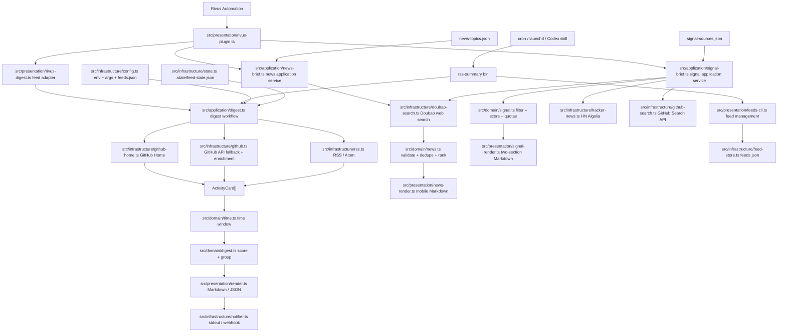

# Architecture

`rss-summary` is a local TypeScript CLI, a small set of portable Codex skills, and an external Rivus Plugin. It is not a daemon or hosted service. Scheduling is handled outside the repo by cron, launchd, systemd, Codex automation, or a Rivus deployment daemon.

The runtime goal is simple: produce a previous-day technical subscription digest from GitHub Home and RSS, bounded noon/evening headline briefs from authoritative web search, and a once-per-day high-signal brief (高信号速览) from public GitHub Search, Hacker News, and official-domain search. Collection and ranking stay independent from Rivus scheduling and Feishu delivery.

## Products

Three independent products share one codebase, one Rivus profile, and one delivery surface:

| Product | CLI / Tool | Sources | Config | State |
| --- | --- | --- | --- | --- |
| Morning digest (技术订阅日报) | `rss-summary digest` / `rss-summary/generate-digest` | GitHub Home + `feeds.json` | env + `feeds.json` | `.state/feed-state.json` (only-new) |
| Noon/evening news (午间/晚间热点) | `rss-summary/generate-news-brief` | Doubao web search | `news-topics.json` | none |
| Signal brief (高信号速览) | `rss-summary signal` / `rss-summary/generate-signal-brief` | GitHub Search + HN Algolia + official-domain Doubao | `signal-sources.json` | none (in-run dedupe) |

Personal RSS answers "what did sources I trust publish?"; signal answers "what rose or shipped in public AI×dev?"; news answers "what happened in the last hours?". They do not share a subscription list.

## High-Level Flow


```mermaid
flowchart TD
  Trigger["cron / launchd / Codex skill"] --> CLI["rss-summary bin"]
  RivusSchedule["Rivus Automation"] --> Plugin["src/presentation/rivus-plugin.ts"]
  Plugin --> FeedAdapter["src/presentation/rivus-digest.ts feed adapter"]
  Plugin --> NewsBrief["src/application/news-brief.ts news application service"]
  Plugin --> SignalBrief["src/application/signal-brief.ts signal application service"]
  FeedAdapter --> Digest
  CLI --> Digest["src/application/digest.ts digest workflow"]
  CLI --> FeedsCommand["src/presentation/feeds-cli.ts feed management"]

  Config["src/infrastructure/config.ts env + args + feeds.json"] --> Digest
  Digest --> GitHubHome["src/infrastructure/github-home.ts GitHub Home"]
  Digest --> GitHub["src/infrastructure/github.ts GitHub API fallback + enrichment"]
  Digest --> RSS["src/infrastructure/rss.ts RSS / Atom"]

  GitHubHome --> Cards["ActivityCard[]"]
  GitHub --> Cards
  RSS --> Cards
  Cards --> Window["src/domain/time.ts time window"]
  Window --> Domain["src/domain/digest.ts score + group"]

  State["src/infrastructure/state.ts .state/feed-state.json"] --> Digest
  Domain --> Render["src/presentation/render.ts Markdown / JSON"]
  Render --> Notify["src/infrastructure/notifier.ts stdout / webhook"]

  Topics["news-topics.json"] --> NewsBrief
  NewsBrief --> Doubao["src/infrastructure/doubao-search.ts Doubao web search"]
  Doubao --> NewsDomain["src/domain/news.ts validate + dedupe + rank"]
  NewsDomain --> NewsRender["src/presentation/news-render.ts mobile Markdown"]

  SignalSources["signal-sources.json"] --> SignalBrief
  SignalBrief --> HackerNews["src/infrastructure/hacker-news.ts HN Algolia"]
  SignalBrief --> GithubSearch["src/infrastructure/github-search.ts GitHub Search API"]
  SignalBrief --> Doubao
  SignalBrief --> SignalDomain["src/domain/signal.ts filter + score + quotas"]
  SignalDomain --> SignalRender["src/presentation/signal-render.ts two-section Markdown"]

  FeedsCommand --> FeedStore["src/infrastructure/feed-store.ts feeds.json"]
```

## Layered Structure

Four folders under `src/` split **jobs**, not a forced run order. Think of them as four drawers:

| Layer | Job (plain language) | May touch network / files? |
| --- | --- | --- |
| **domain** | Rules: score, dedupe, quotas — the **referee** | No |
| **application** | Workflow: who to call today, how to degrade — the **director** | Only by calling others |
| **infrastructure** | Adapters: HTTP clients, JSON loaders — the **runners** | Yes |
| **presentation** | Entrypoints + layout: CLI / Rivus / Markdown — the **front desk + typesetter** | Entrypoint wiring only |

This is **not** a linear dependency chain `domain → application → infrastructure → presentation`.  
It is **onion / inward dependencies**: outer layers may use inner ones; **domain depends on nothing outside itself**.

```text
              presentation          (CLI, Rivus, Markdown)
             /      |      \
            v       v       v
     application  domain  infrastructure
            \       ^       /
             \      |      /
              ------+------
```

| Layer | May import | Must not import |
| --- | --- | --- |
| **domain** | only `domain/*` | application, infrastructure, presentation, Effect, Node IO |
| **application** | domain; infrastructure for default wiring | **presentation** (render is injected or done at the entrypoint) |
| **infrastructure** | domain (types / shapes) | application, presentation |
| **presentation** | application, domain, infrastructure (as composition root) | — (outermost) |

Import guards for domain purity and `application ↛ presentation` are enforced by ESLint (`eslint.config.js`) plus `pnpm test:layout` for the mirrored test tree.

### Runtime vs import direction

Easy to mix up:

| Concept | Direction |
| --- | --- |
| **Imports (compile-time)** | Outer → inner (presentation / application / infrastructure → domain) |
| **Data flow (run-time)** | roughly ingest (infra) → filter/rank/select (domain) → render (presentation), **orchestrated by application** |

So application is the **director**, infrastructure the **runners**, domain the **referee**, presentation the **front desk + typesetter** — not “domain first, then application, then infra, then presentation” as a single cascade of imports.

### Walkthrough: `rss-summary signal --day …`

1. **presentation** `signal-cli.ts` — parse `--day`, call application, write markdown to stdout.  
2. **application** `signal-brief.ts` — resolve the calendar day; fan out to Doubao / HN / GitHub Search; record per-source warnings; hand candidates to domain.  
3. **domain** `signal.ts` — pure filter / score / dedupe / soft balance / quotas → `SignalItem[]` (still data, not Markdown).  
4. **presentation** `signal-render.ts` — format `# 高信号速览 · day` sections.  

Swap CLI for Rivus (`rivus-plugin.ts`) and the same application + domain path runs; only the entrypoint changes.

### Why four drawers (test angle)

| You want to prove… | Test which layer | Need live network? |
| --- | --- | --- |
| “awesome-* repos are dropped” | domain | No — fake hits |
| “HN down still yields 开源” | application | Mock the three search ports |
| “Algolia query string is correct” | infrastructure | Mock `fetch` |
| “`--day` without a value exits 1” | presentation | Mock `generate` |

### What this is *not* (full tactical DDD)

The layout is **DDD-inspired layered architecture**, deliberately thin:

- No Aggregate / Repository interface layer; application may construct concrete infrastructure clients (deps-object injection for tests).
- Domain is mostly **pure functions over DTOs**, not long-lived entities.
- Shared kernels (`domain/text.ts`, `domain/time.ts`) serve all three products in one package.

Deepening toward ports-only application + interface implementations is documented as a future option in `docs/technology-decisions.md`, not a current requirement.

### Tree map

```
src/
  domain/          pure rules and models, zero IO, no Effect, no infra imports
    digest.ts      ActivityCard normalization + CandidateProject ranking
    news.ts        NewsTopic policy + story validate/dedupe/rank
    signal.ts      SignalItem contract + filter/score/dedupe/quotas
    time.ts        calendar-day + rolling + explicit windows (shared kernel)
    text.ts        URL canonicalization, publish-time parsing, summary
                   compaction, same-event title collapse (shared kernel)
  application/     use cases; return Effect<Result, Error>
    digest.ts      collection/enrichment/state orchestration (run + buildDigestDocument)
    news-brief.ts  noon/evening windows + bounded query fan-out
    signal-brief.ts daily window + three-source fan-out
    effect.ts      attempt(): lifts promise ports into the typed Error channel
  infrastructure/  adapters and IO
    github-home.ts, github.ts, github-search.ts, hacker-news.ts,
    doubao-search.ts, rss.ts, config.ts, news-topics.ts, signal-sources.ts,
    state.ts, feed-store.ts, notifier.ts, parsing.ts (shared helpers)
  presentation/    entrypoints and rendering
    cli.ts, feeds-cli.ts, signal-cli.ts, github-home-cli.ts,
    rivus-plugin.ts, rivus-digest.ts,
    render.ts, news-render.ts, signal-render.ts, markdown.ts (shared helpers)
```

Layer rules (summary):

- **Domain is pure.** No IO, no Effect, no `process`, no imports outside `domain/`. Rules are pure functions over plain data so the unit suite stays network-free and fast.
- **Application owns orchestration.** Use cases accept injectable deps objects and default to real adapters; they never talk to Rivus or Feishu, and they do not import presentation renderers.
- **Infrastructure owns adapters.** Clients stay imperative async classes; shared JSON/validation helpers live in `parsing.ts`.
- **Presentation owns entrypoints.** CLI / Rivus wrap application effects with `Effect.runPromise`; renderers only format already-selected data.

## Side-Effect Management (Effect)

[Effect](https://effect.website) (3.x) manages side effects at the application boundary:

- Application use cases return `Effect<Result, Error>`; failures are typed as `Error`.
- `attempt()` in `application/effect.ts` lifts promise-returning ports into the `Error` channel via `Effect.tryPromise`; per-source failure isolation keeps the existing `Promise.allSettled` semantics.
- Domain rules stay framework-free; the `Error` channel exists only at the application layer.
- Entrypoints run effects with `Effect.runPromise`.

Adoption is deliberately shallow: deps-object injection (not `Context`/`Layer` services), no retry/clock/logging services. See `docs/technology-decisions.md` for when to deepen it.

## Data-Flow View

Every product is the same pipeline with different steps: **ingest → filter → rank → select → render → deliver**. The layered structure is a "layered pipeline": domain steps are pure, application wires them with IO, presentation renders.

| Stage | Digest | News brief | Signal brief |
| --- | --- | --- | --- |
| Ingest | GitHub Home/events + RSS | Doubao queries per topic | Doubao official intents + HN + GitHub Search |
| Filter | `domain/time.ts` window | time + authority + window | time window + awesome exclusion + window |
| Rank | `domain/digest.ts` scores | `domain/news.ts` scores | `domain/signal.ts` scores |
| Select | state `onlyNew` | per-topic + 8 cap | quotas + soft model/product balance |
| Render | `presentation/render.ts` | `presentation/news-render.ts` | `presentation/signal-render.ts` |
| Deliver | notifier / webhook | Rivus card | Rivus card |

The three pipelines intentionally do not share an abstraction: digest has state and GitHub-specific enrichment, news has topic quotas and authority checks, signal has multi-source agreement and repo metrics. A unified pipeline framework would buy nothing and cost configurability.

## Digest Workflow

`rss-summary digest` runs this sequence:

1. `src/infrastructure/config.ts` reads environment variables, CLI flags, optional `feeds.json`, and default interests.
2. `src/application/digest.ts` fetches GitHub Home cards and RSS/Atom feeds in parallel. With `GITHUB_HOME_FETCH=conduit` it fetches `/conduit/for_you_feed?requested_from_filter_event=true` with the saved web session and falls back to rendered browser parsing. With `GITHUB_FEED_SOURCE=events` it fetches REST `received_events`. With `--rss-only` / `FEED_RSS_ONLY=true`, GitHub fetching is skipped.
3. `src/domain/time.ts` filters events by an explicit calendar day or a rolling hour window.
4. `src/infrastructure/github.ts` optionally fetches followed accounts, repository metadata, and up to 20 pull request details.
5. `src/domain/digest.ts` builds ranked `CandidateProject` records from normalized events.
6. `src/infrastructure/state.ts` filters previously seen event IDs when `--only-new` is set.
7. `src/presentation/render.ts` emits Markdown or JSON.
8. `src/infrastructure/notifier.ts` writes to stdout and optionally sends `{ "text": markdown }` to `NOTIFY_WEBHOOK_URL`.
9. If `--only-new` is set and the run is not `--dry-run`, `.state/feed-state.json` is updated with seen event IDs.

`buildDigestDocument` exposes steps 1–6 as a delivery-free application boundary. The CLI renders and delivers; the Rivus adapter renders as Markdown and forces dry-run mode. Rivus `0.3.x` promotes the first Markdown heading into a proactive Feishu card header and owns delivery. Both entrypoints share one collection and ranking implementation.

For scheduled daily summaries, prefer explicit calendar-day mode:

```bash
FEED_DAY="$(TZ=Asia/Shanghai date +%F)" rss-summary digest --only-new
```

Without `FEED_DAY` or `--day`, the CLI uses the compatibility rolling window from `FEED_WINDOW_HOURS`, defaulting to 36 hours.

## News Brief Workflow

The Rivus Tool `rss-summary/generate-news-brief` (or tests calling `generateRivusNewsBrief`) runs this sequence:

1. `src/infrastructure/news-topics.ts` loads `news-topics.json`; env overrides: `NEWS_TOPICS_FILE`, `NEWS_SEARCH_COUNT_PER_QUERY`, `NEWS_SEARCH_TIMEOUT_MS`.
2. `src/application/news-brief.ts` resolves the non-overlapping noon (00:00–12:30) or evening (12:30–occurrence) window from the occurrence and `FEED_TIMEZONE_OFFSET`.
3. One bounded Doubao search runs per enabled topic query (`sourcePolicy: "official"` requires `AuthInfoLevel=1`; `authoritative` accepts 1–2), each scoped to the local calendar day.
4. `src/domain/news.ts` independently rechecks publication time and authority, canonicalizes URLs, merges duplicate hits, collapses the same event across publishers, ranks stories, and applies per-topic quotas with a hard 8-story cap.
5. `src/presentation/news-render.ts` emits `# 午间热点 · YYYY-MM-DD` / `# 晚间热点 · YYYY-MM-DD` with two-sentence summaries, source, and time.

Partial query failures produce a `数据源状态` warning; if every query fails, the Tool fails so Rivus can apply its normal failure handling.

## Signal Brief Workflow

`rss-summary signal` (or the Rivus Tool `rss-summary/generate-signal-brief`) answers "what shipped or rose in public AI×dev today":

1. `src/infrastructure/signal-sources.ts` loads `signal-sources.json`; env overrides: `SIGNAL_SOURCES_FILE`, `SIGNAL_SEARCH_TIMEOUT_MS`.
2. `src/application/signal-brief.ts` resolves the local calendar day (from `occurrence` or explicit `day`) and fans out in parallel:
   - Doubao official search (`sourcePolicy: "official"`, one query per configured intent, kind `model` or `product`),
   - Hacker News Algolia (`search_by_date`, `points>minPoints`, optional `show_hn` tag), filtered to the day and re-ranked by points,
   - GitHub Repository Search (`created:>=`, `stars:>`, free-text keyword `OR`), sorted by stars.
3. `src/domain/signal.ts` rechecks publication windows, applies HN AI×dev title relevance (word-boundary keywords), canonicalizes URLs, collapses the same event across publishers, scores deterministically (official-domain, HN points, frontend keywords, recency, cross-source agreement for updates; stars, newness, language/topic match, description/language penalties for repos), and applies quotas (`maxTotal` 8, `updates` 5 with soft model/product balance then score-desc display order, `opensource` 4). GitHub Search free-text uses `topics` (languages are a domain scoring bias only).
4. `src/presentation/signal-render.ts` emits `# 高信号速览 · YYYY-MM-DD` with two optional sections and omits empty ones.

There is no persistent `.state` for signal briefs; dedupe is in-run only. The CLI is inherently dry-run (read-only, no webhook). The pipeline never reads `feeds.json` and never calls `RssClient`.

## Feed Management Workflow

RSS/Atom sources are maintained in the tracked `feeds.json` file. `src/presentation/feeds-cli.ts` manages the shared subscription list over `src/infrastructure/feed-store.ts`:

```bash
rss-summary feeds add --url "https://example.com/feed.xml" --name "Example" --tags "ai,agent"
rss-summary feeds list
rss-summary feeds test
rss-summary feeds remove --url "https://example.com/feed.xml"
```

Commit intentional `feeds.json` changes through the pull request workflow. The digest command always uses the tracked `feeds.json` as its RSS source list.

## Domain Model

`ActivityCard` is the normalized input unit for the digest. GitHub events and RSS items both become activity cards with a source, actor, repository-like identifier, timestamp, title, summary, and link fields.

`CandidateProject` is the ranked output unit. It groups related cards by repository or article identity, records actors and event types, assigns a category, and explains why the item is worth attention (`reasons`).

`NewsStory` / `SignalItem` are the ranked output units of their products, each carrying enough explainable metadata (score + reasons; for signal also metrics like stars/age/language) to render without re-deriving domain logic.

## Research Workflow

Deep research is a Codex skill workflow, not a deterministic CLI subcommand. The CLI can emit machine-readable candidates:

```bash
rss-summary digest --json --only-new --dry-run
```

`skills/feed-research-digest` consumes those candidates and instructs Codex to inspect the relevant repository, PR, release, README, docs, or article page before deciding whether an item is worth attention. The state file has a `researched` field the CLI does not yet write or filter by.

## GitHub Identity And Visibility

The machine identity does not control GitHub visibility. In exact Home mode, the saved GitHub web session identity does. In REST fallback mode, the token identity does.

- `GITHUB_FEED_SOURCE=home` uses `.state/github-home-storage.json` and reads the same Home feed cards the account sees in the browser.
- `GITHUB_HOME_FETCH=conduit` is the default Home fetch mode. It parses GitHub's internal conduit HTML response and automatically falls back to browser-rendered parsing when the internal request is unavailable.
- `rss-summary github-home login` creates or refreshes that storage state. Do this once on each scheduled machine.
- `GITHUB_FEED_SOURCE=events` uses `received_events`; a token created by `PerfectPan` can see `PerfectPan` received events that the token is allowed to read, while another account only sees public received events for `PerfectPan`.

Keep `GH_FEED_TOKEN`, `.env`, and `.state/` out of git. `feeds.json` is intentionally tracked as the shared RSS subscription list.

## Extension Points

- Add a new source: create an adapter that returns `ActivityCard[]`, then wire it into `src/application/digest.ts` before the event-window filter.
- Add RSS-like source management: extend `src/infrastructure/feed-store.ts` and `src/presentation/feeds-cli.ts` if the source needs local subscriptions.
- Tune usefulness: adjust interests, base scores, category rules, or reason generation in `src/domain/digest.ts`.
- Add deep research caching: connect `state.researched` to the research skill or add a dedicated CLI command that records research decisions.
- Add delivery channels: extend `src/infrastructure/notifier.ts` or add notifier adapters for Feishu, Slack, Telegram, email, or other targets.
- Add Rivus capabilities: register narrow Tools in `src/presentation/rivus-plugin.ts` and delegate them to application-level functions instead of copying source or ranking logic into the Plugin.
- Add content deduplication: cluster RSS/article candidates by canonical URL, title, or content fingerprint before scoring.
- Add signal sources (later tiers): Hugging Face, Product Hunt, or GitHub Trending HTML adapters feed `SignalRepoHit`-shaped candidates into `src/domain/signal.ts`.
- Add persistent signal state: introduce a `.state/signal-state.json` seen-set so repos/URLs are not re-pushed within N days; keep it behind an explicit flag.
- Deepen Effect adoption: replace deps-object injection with Effect `Context`/`Layer` services if the application boundary grows beyond three use cases.

## Current Gaps

- GitHub Home exact mode depends on GitHub's internal conduit endpoint, rendered DOM, and `data-hydro-view` card metadata, so it may need maintenance if github.com changes the Home page structure.
- Deep project/article research is skill-driven, not a built-in CLI command.
- `researched` state exists in the schema but is not yet used by the CLI.
- Webhook delivery is generic only.
- RSS deduplication is based on generated item IDs, not content similarity.
- Doubao official-search hits with a missing/unparseable `PublishTime` are dropped by the window filter without a warning (query is day-scoped, so impact is bounded).
- This repository has no built-in daemon; a consuming Rivus deployment can host the exported Automation.
