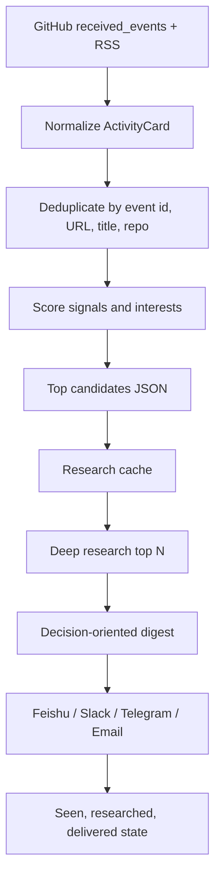

# Digest And Delivery Research

Checked on 2026-06-28.

## Question

How should `rss-summary` summarize GitHub/RSS activity and push it in a way that is useful instead of becoming another notification stream?

## What The Community Pattern Looks Like

Modern feed tools and automation workflows converge on the same shape:

1. Ingest many sources.
2. Filter, deduplicate, and rank before using an LLM.
3. Summarize only selected items.
4. Deliver one scheduled digest to the user's existing attention surface.
5. Keep state so the same item is not repeatedly researched or pushed.

Feedly's AI Feeds save a query and tuning setup, then keep updating with matching articles. Inoreader separates filters from automations such as notifications and webhooks. Readwise Reader is conservative with automatic feed summarization: feed documents are not auto-summarized by default unless the user enables it with their own OpenAI key. Community n8n workflows follow the same pipeline: scheduled RSS reads, merge/deduplicate, model-based summary and importance score, then a sorted daily digest sent to Slack and email.

The implication for this repo: do not push raw GitHub events, raw RSS items, or every LLM summary. Push a curated daily brief.

## Recommended Summary Shape

The pushed digest should be decision-oriented:

```text
# Daily Feed Brief - YYYY-MM-DD

## 今日最值得看
1. Title / repo / article
   - Why it matters:
   - Suggested action: try | read | track | save | skip

## 短线观察
- Smaller signals worth tracking but not acting on today.

## 可以略过
- Only include skipped items when the skip decision prevents future repeated research.

## 后续行动
- 1-3 concrete follow-ups.
```

Each recommended item should include:

- Link and source.
- One-sentence gist.
- Signal: who starred, release, merged PR, RSS source, or repeated trend.
- Relevance to the user's interests.
- Recommended action: `try`, `read`, `track`, `save`, or `skip`.
- Confidence: `high`, `medium`, or `low` when the evidence is incomplete.

Merged PR cards need extra interpretation and daily-briefing language. The final digest should not say only "important PR merged" or use implementation-log labels like "this merge"; it should say what happened today, whether it deserves attention, and what the project is. A merged PR entry should answer:

- Project: what the repo is for.
- What happened today: behavior/API/docs/security/tooling change from the PR body and changed-file signal.
- Why it matters: relevance to the user's agent/tooling/frontend/Rust/TypeScript interests.
- Suggested action: read now, track, save, try, or skip.

Keep evidence checked in research notes and structured state, but do not show an `evidence` or `依据` field in the final daily brief unless the user explicitly asks for citations.

Avoid:

- Flat timelines.
- More than 5-8 primary items.
- LLM summaries for every RSS article.
- Repeating low-value items just because they are new.
- Pushing an empty daily message unless there were source or token errors.

## Recommended Pipeline



### Stage 1: Collect And Rank

This is mostly the current CLI:

- Fetch GitHub `received_events`.
- Fetch tracked RSS feeds from `feeds.json`.
- Normalize source events into `ActivityCard`.
- Filter by calendar day.
- Score by signal strength, followed actors, interest match, recency, and repeated signals.
- Emit JSON candidates for the research layer.

This stage should stay deterministic and cheap.

### Stage 2: Research Only The Candidates

Research only the top candidates after filtering:

- Default: top 5-8 candidates.
- Always research `watch` / star events for unknown repos above threshold.
- Always inspect releases and merged PRs when they match interests.
- For RSS articles, open the article page when accessible instead of relying on the feed excerpt.
- Stop researching once a candidate is clearly low-value, but record the skip reason.

The research layer should update state:

```json
{
  "researched": {
    "github:owner/repo": {
      "at": "2026-06-28T01:00:00.000Z",
      "decision": "track",
      "reason": "agent tooling repo with recent release and strong README examples"
    }
  }
}
```

### Stage 3: Compose For Attention

The digest should be optimized for a human scanning on a phone:

- Put the strongest 3-5 items first.
- Use short paragraphs, not raw JSON or long bullet nests.
- Keep a clear `action` on every item.
- Include source links so the user can open the original quickly.
- Include skipped/researched decisions only when they prevent duplicate future work.

### Stage 4: Push Once

The default should be one scheduled daily push, e.g. `09:00 Asia/Shanghai`.

Push rules:

- Push only after research and final composition.
- Do not push raw candidate JSON.
- Do not push per-event notifications.
- Suppress duplicate delivery by recording delivered digest IDs.
- If there are no high-value items, skip push by default and write logs/state locally.
- If source fetches fail, push a short operational warning only when the failure changes the digest quality.

## Delivery Channel Recommendation

Use a generic intermediate delivery model, then render per provider:

```ts
type DeliveryMessage = {
  title: string;
  summary: string;
  sections: Array<{
    title: string;
    items: Array<{
      title: string;
      url: string;
      text: string;
      action?: "try" | "read" | "track" | "save" | "skip";
    }>;
  }>;
};
```

Provider order for this repo:

1. Feishu custom bot card or rich text.
   - Best if the user's daily workspace is Feishu.
   - Supports webhook push, text/rich text/image styles, and security settings such as keyword, IP allowlist, and signing.
2. Slack incoming webhook.
   - Good fallback and widely supported.
   - Slack incoming webhooks accept JSON payloads and can use formatting/layout blocks.
3. Telegram bot `sendMessage`.
   - Best for personal mobile push.
   - Keep messages shorter and link-heavy.
4. Email.
   - Useful for archive/search, but slower for day-to-day action.

The current `{ "text": markdown }` generic webhook is a good compatibility floor, but it should not be the final shape for Feishu/Slack because cards/blocks make scanning much better.

## Implementation Plan

1. Add research state.
   - Wire `state.researched` into the CLI or a new `rss-summary research` command.
   - Key by stable candidate identity: repo full name, release URL, PR URL, RSS canonical URL.

2. Add delivery state.
   - Record `delivered` digest IDs by `day + channel`.
   - Prevent accidental duplicate pushes from retries.

3. Split renderers.
   - Keep Markdown for stdout and archives.
   - Add `DeliveryMessage` as the internal notification shape.
   - Render provider-specific payloads for Feishu, Slack, Telegram, and plain webhook.

4. Add a research prompt contract.
   - Input: JSON candidates.
   - Output: structured digest decisions.
   - Include `decision`, `confidence`, `evidenceChecked`, `reason`, and `action`.

5. Change scheduled flow.
   - `rss-summary digest --json --only-new --dry-run`
   - research top candidates
   - compose final digest
   - push once
   - mark seen/researched/delivered

## Open Decisions

- Primary push channel: Feishu, Slack, Telegram, email, or multiple.
- Whether an empty day should push nothing or send a compact "no high-signal items" note.
- Whether research should run inside the CLI, a Codex skill, or a separate automation wrapper.
- Whether to store Markdown archives in `.state/`, a tracked `digests/` folder, or only in the delivery channel.

## Sources

- Feedly AI Feeds: https://docs.feedly.com/article/769-saving-ai-feeds-feedly
- Feedly mute filters: https://docs.feedly.com/article/251-muting-topics
- Feedly deduplication: https://docs.feedly.com/article/218-how-does-deduplication-work
- Inoreader automations: https://www.inoreader.com/blog/2026/01/save-time-with-automations.html
- Readwise Reader Ghostreader: https://docs.readwise.io/reader/docs/faqs/ghostreader
- n8n daily AI RSS digest workflow: https://n8n.io/workflows/13674-summarize-rss-feeds-into-a-daily-ai-digest-with-gemini-slack-and-gmail/
- GitHub notifications: https://docs.github.com/en/subscriptions-and-notifications/concepts/about-notifications
- Slack incoming webhooks: https://docs.slack.dev/messaging/sending-messages-using-incoming-webhooks/
- Feishu custom bot: https://open.feishu.cn/document/client-docs/bot-v3/add-custom-bot
- Telegram Bot API `sendMessage`: https://core.telegram.org/bots/api#sendmessage
